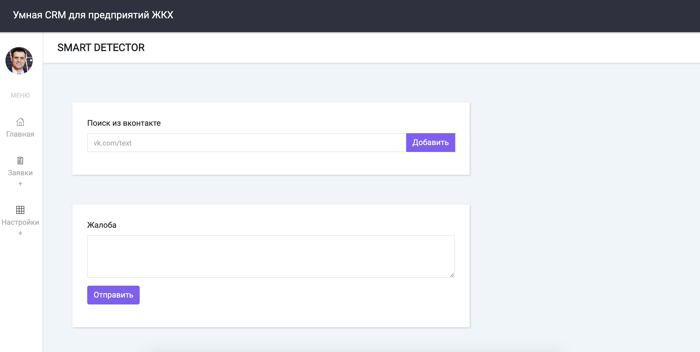
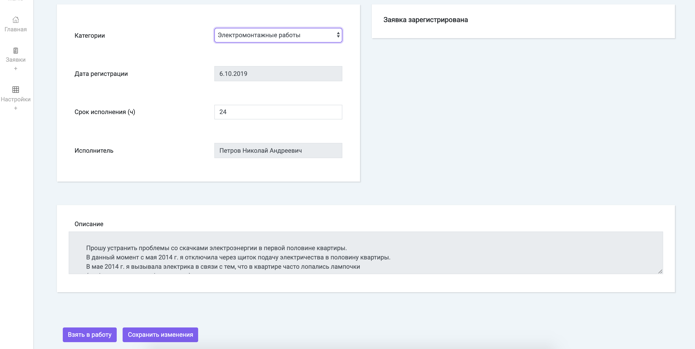
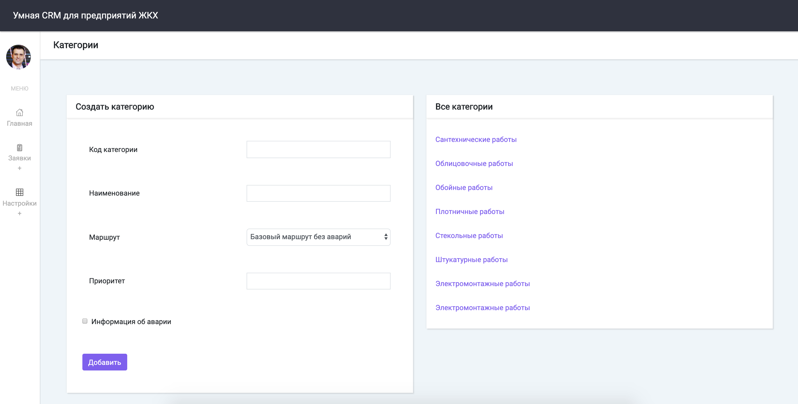
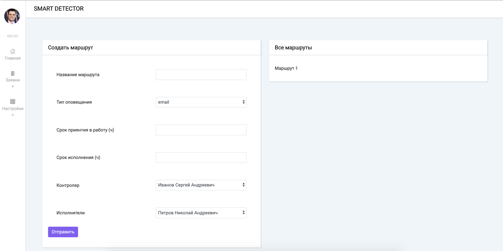

# Секция №17 "Проблемы ЖКХ"

Данный репозиторий содержит решение команды "ЦуП" в рамках
финала конкурса
[Цифровой прорыв 2019](https://xn--b1aaqfxbbhefb3bya5f.xn--p1ai/)
Решение сделано за 48 часов.

Рабочий прототип команды в региональном этапе по направлению
"ГОСУДАРСТВЕННОЕ УПРАВЛЕНИЕ И УСЛУГИ" можно найти по
[ссылке](https://github.com/demid5111/demos-voice).

## Состав команды

1. Белов Сергей (капитан)
[fb](https://www.facebook.com/profile.php?id=100002394559660)
2. Демидовский Александр (разработчик серверной и AI/ML части)
[vk](https://vk.com/demid5111)
3. Земсков Владимир (разработчик клиентской части)
5. Колчина Мария (бизнес-аналитик)

## Проблема

Ежедневно в управляющие компании (УК) поступают обращения по
проблемам различного характера. Оператору УК необходимо
осуществлять регистрацию обращений, информирование заявителей
о статусе обращения и передачу обращения исполнителю. Оператор тратит
много времени на рутинные операции. Отсутствует контроль обратившегося
человека над обращением. Оператор тратит много времени на определение
куда должна быть адресована заявка.

## Задача

Создать универсальное веб-приложение для предприятий сферы жилищного
хозяйства, позволяющее распознавать смысл обращения, распределять
обращения по ответственным сотрудникам и отслеживать их выполнение.

## Требования к результату

Функционал web-приложения должен предусматривать:

1. Классификация обращений.
2. Конфигурируемые справочники.
3. Автоматизация рутинных задач (попробовать развернуть).
4. Информирование об авариях/событиях.
5. Визуальное представление маршрутов прохождения заявки от стадии
   регистрации до выполнения.
6. Возможность создания и редактирования маршрутов.
7. Интеграция с внешними сервисами для регистрации заявки.
8. Интеграция с внешними сервисами для определения статуса и
   маршрута прохождения заявки.
9. Нотификация заинтересованных лиц о прохождении этапов маршрута.
10. Интерфейс обучения классификатора.
11. Контроль сроков прохождения ключевых точек маршрута выполнения
   заявки.

## Техническая информация

### Запуск

1. Добавьте файл `.secret_access_token`
в корень проекта. Файл содержит `access_token` зарегистрированного
приложения в ВКонтакте
2. Добавьте файл `.secret_mail_password` в корень проекта. Файл
содержит пароль от почты `gmail`
3. В папку `result` положить следующее:
   ```
   |-- result
        |-- classifiers
            |-- bayes.joblib
            |-- log_regression.joblib
            |-- nn.h5
            |-- svm.joblib
        |-- categories
            |-- categories.json
   ```
4. `pip3 install -r requirements.txt`
5. `cd ui`
6. `npm install`
7. `npm start`
8. В другой консоли выполните: `python3 main.py`
9. Открывайте в браузере ссылку:
   [http://localhost:1234](http://localhost:1234)

### Тренировка классификаторов

1. В папку `data` положить следующее:
   ```
   |-- data
        |-- sample_dataset.xlsx
   ```
2. Для тренировки использовать скрипт
   `app/core/predictors/classifiers/models.py`

## Примерный вид прототипа

### Стартовый экран



### Работа с заявкой



### Создание новой категории заявок



### Создание нового маршрута обработки заявок


